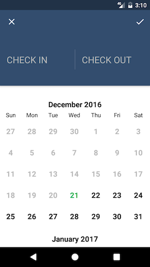
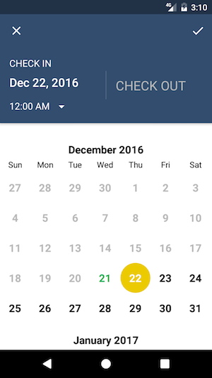
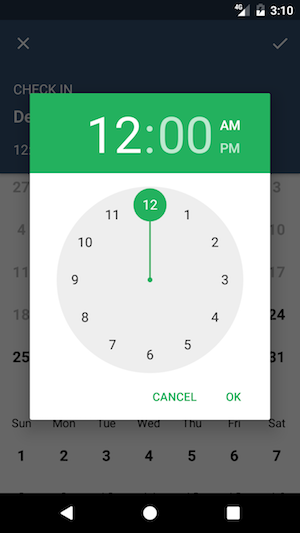
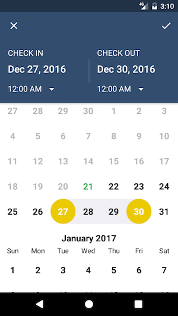

# DateTimeRangePicker
[](https://jitpack.io/#skedgo/DateTimeRangePicker)

A date time range picker for android

 

 

## Usage
With start and end date times specified:
```kotlin
val intent = DateTimeRangePickerActivity.newIntent(
    context,
    TimeZone.getDefault(),
    DateTime.now().millis,
    DateTime.now().plusDays(2).millis
)
activity.startActivityForResult(intent, RQC_PICK_DATE_TIME_RANGE)
```

Or without start and end date times:
```kotlin
val intent = DateTimeRangePickerActivity.newIntent(
    context,
    TimeZone.getDefault(),
    null, null
)
activity.startActivityForResult(intent, RQC_PICK_DATE_TIME_RANGE)
```

At `onActivityResult()`, `DateTimeRangePickerActivity` will return an `Intent` data having following:  
* `startTimeInMillis` as `Long`
* `endTimeInMillis` as `Long`
* `timeZone` as `String`

## Demo
Run 2 following instrumentation tests on `DateTimeRangePickerActivityTest` to see the 2 usages:
* `showDateTimeRangePickerWithoutStartAndEndDateTimes()`
* `showDateTimeRangePickerWithStartAndEndDateTimes()`
  
